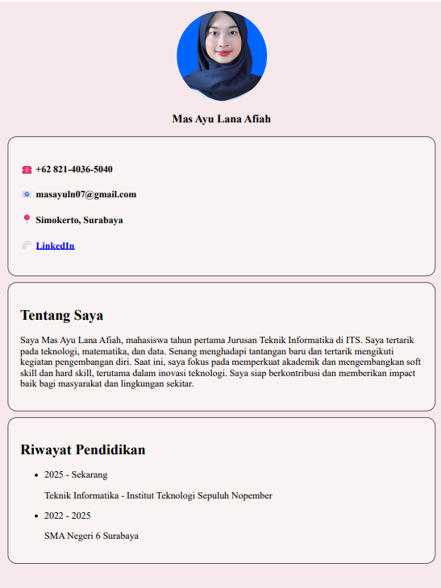
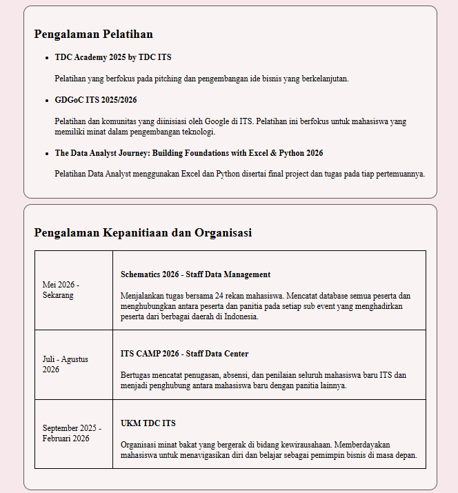
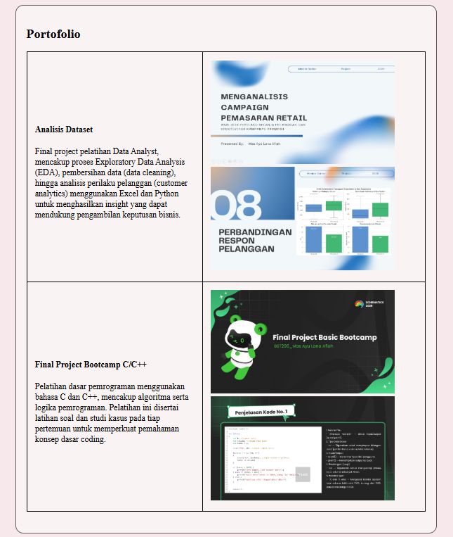

### Pembuatan Website Data Diri dan Portofolio

- Nama: Mas Ayu Lana afiah
- NRP: 5025251064
- Kelas: Pemrograman Web B

---

Website yang telah dibuat merupakan hasil penerapan sederhana dari HTML dan CSS. Adapun isi dari web tersebut
meliputi profile singkat, deskripsi, riwayat pendidikan, pengalaman kepanitiaan, organisasi, dan pelatihan, 
serta portofolio yang didapat dari final project pelatihan yang saya ikuti. 

Pada penerapan HTML, saya menggunakan penerapan sebagai berikut:
- struktur dokumen HTML yang meliputi `<html>`, `<head>`, `<body>`
- elemen dasar, seperti `
`, heading `<h2>`, paragraph `
`, unorder list, hyperlink, gambar, dan tabel.
Selain itu, saya juga menggunakan atribut `class` sebagai penanda elemen yang akan diedit di 'tampilan.css'.

Pada penerapan CSS, saya menggunakan selector tag, class, atribut, warna, ukuran gambar, posisi text, hingga penataan untuk bagian `body`.

Berikut merupakan overview dari website yang telah saya buat.

