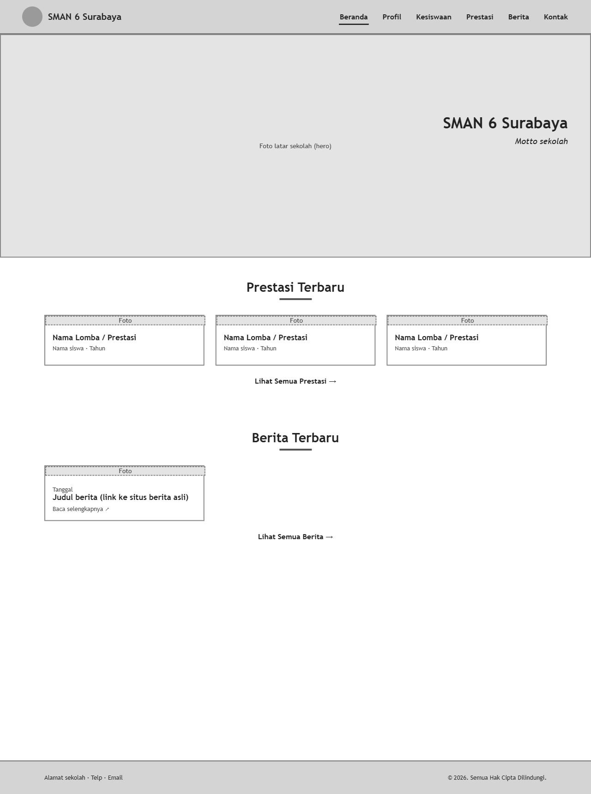
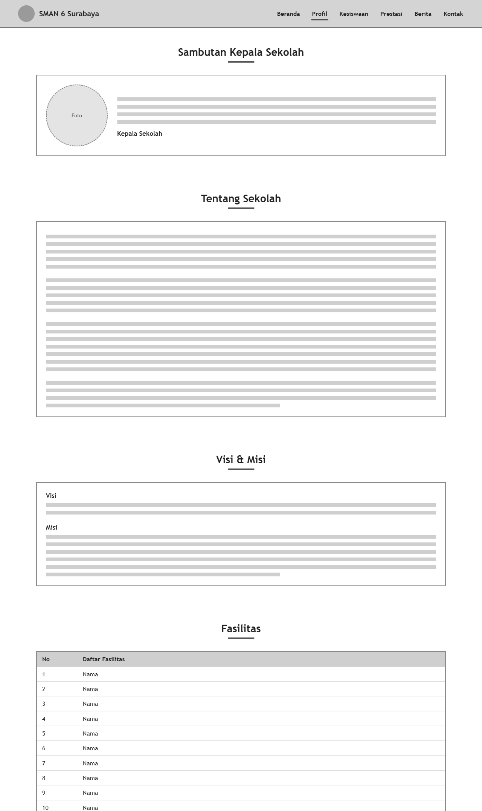
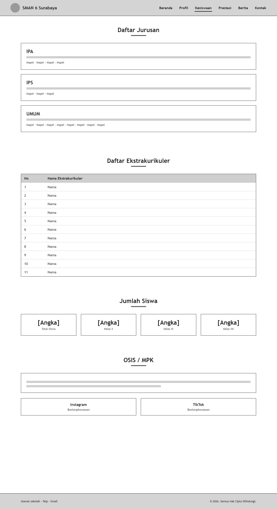
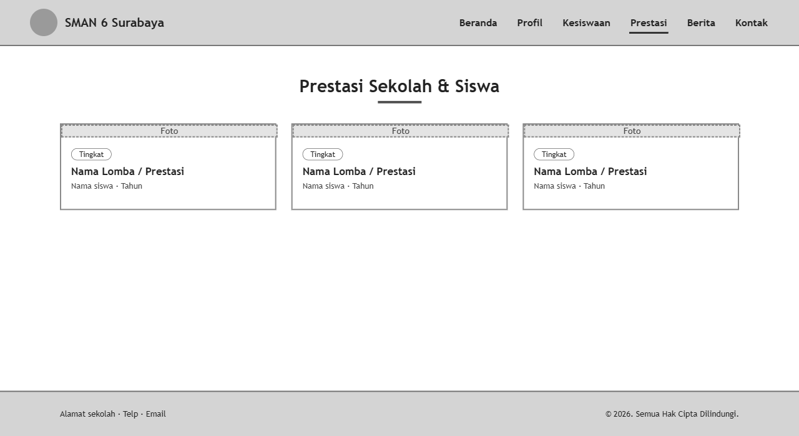
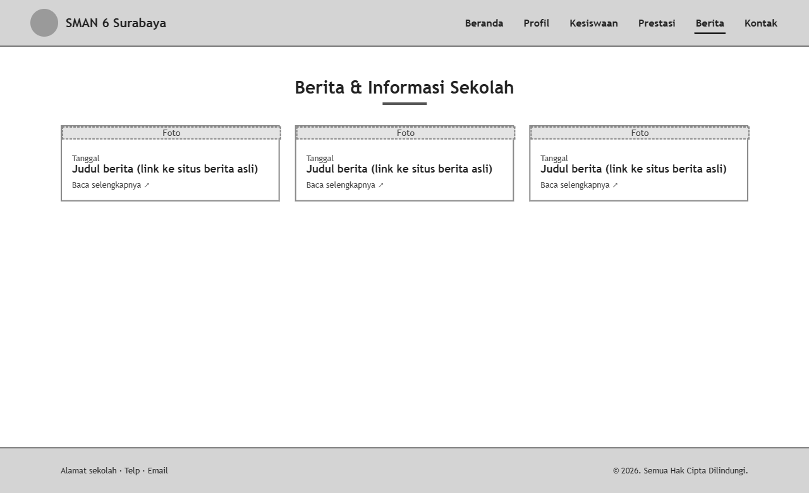
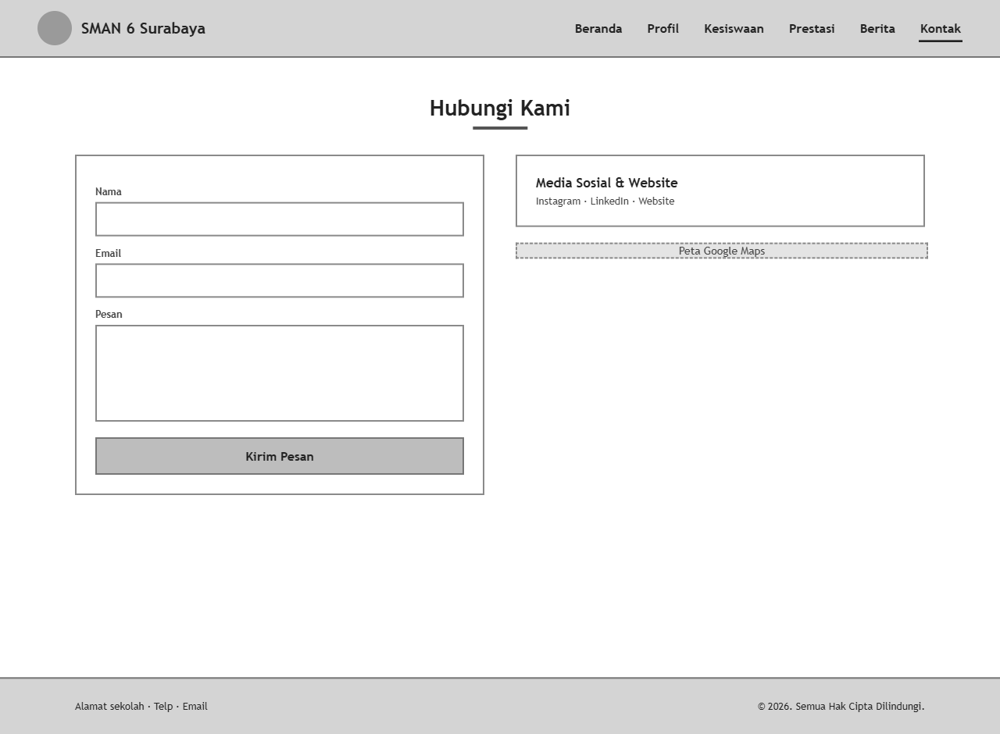
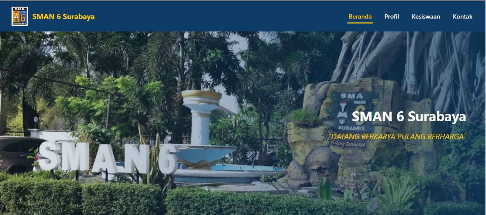

# Website SMAN 6 Surabaya
- Nama: Mas Ayu Lana afiah
- NRP: 5025251064
- Kelas: Pemrograman Web B

Pada pertemuan 3 ini kami mempelajari tools pengembangan web. Materi pembelajaran yang disampaikan adalah konsep client-server, front-end & back-end, tools pengembangan web, dan struktur dasar aplikasi web. Dari pembelajaran di kelas, terdapat latihan studi kasus untuk membuat website masing-masing sekolah asal. Disini saya membuat website SMAN 6 Surabaya.

Website yang saya buat berisi gambaran singkat SMAN 6 Surabaya. Terdapat profile sekolah yang berisi sejarah, visi, dan misi SMAN 6 Surabaya. Kemudian, terdapat pula fitur kesiswaan yang memuat jurusan dan ekstrakulikuler. Terakhir, terdapat fitur kontak yang menampilkan website dan sosial media sekolah.

**Sumber Web Sekolah: [sman6sby](https://sman6sby.sch.id/)**

### Wireframe

### Preview UI 

---

### File [`index.html`](index.html)
Pada file ini saya mengatur bagian beranda dan profil yang menjadi satu. Pada tampilan beranda, terdapat logo SMAN 6 Surabaya dan gambar background berkaitan yang saya masukkan. Saya juga menambahkan header dan footer yang akan ada pada setiap halaman. Terdapat juga navigasi menu. Serta, tampilan tentang sekolah dan visi misi yang menggunakan `<ol></ol>`.

### File [`profil.html`](profil.html)
Pada file ini halaman profil terbagi menjadi beberapa section. Bagian pertama adalah sambutan kepala sekolah, berisi foto berbentuk lingkaran dan teks sambutan. Kemudian ada section tentang sekolah yang berisi sejarah singkat SMAN 6 Surabaya dalam beberapa paragraf `

`. Setelah itu terdapat visi dan misi, dengan misi ditampilkan menggunakan <ol></ol> agar berurutan. Terakhir, terdapat tabel daftar fasilitas sekolah menggunakan <table></table>. Pada halaman ini saya juga menambahkan header, navigasi menu, dan footer yang sama seperti halaman lainnya.

### File [`prestasi.html`](prestasi.html)
Pada file ini, saya menampilkan daftar prestasi sekolah dan siswa menggunakan display: grid di CSS. Setiap kartu berisi foto prestasi, label tingkat prestasi, nama lomba, serta nama siswa dan tahunnya. Terdapat efek naik saat kursor diarahkan dan muncul perlahan saat halaman di-scroll. Pada halaman ini saya juga menambahkan header, navigasi menu, dan footer yang sama.

### File [`berita.html`](berita.html)
Pada file ini, saya menampilkan berita dan informasi sekolah menggunakan display: grid. Setiap kartu bisa diklik dan langsung menuju berita aslinya di website lain. Link tersebut memakai `target="_blank"` agar terbuka di tab baru. Setiap card berisi gambar berita, tanggal, dan judul. Pada halaman ini saya juga menambahkan header, navigasi menu, dan footer seperti halaman lainnya.

### File [`kesiswaan.html`](kesiswaan.html)
Pada file ini, terdapat daftar jurusan menggunakan `<ul></ul>` yang terbagi menjadi beberapa section. Kemudian terdapat tabel daftar ekstrakurikuler menggunakan `<table></table>`. Pada halaman ini saya juga menambahkan header footer yang sama.

### File [`kontak.html`](kontak.html)
Pada file ini, terdapat section hubungi kami dengan menggunakan `label` dan `input` nama, email, dan pesan. Serta tombol `button` untuk mengirim pesan. Kemudian, terdapat daftar media sosial yang langsung menuju pada laman tertentu. Terdapat juga tampilan maps lokasi menggunakan `iframe`. Ditambahkan juga header dan footer seperti halaman lainnya.

### File [`style.css`](style.css)
Pada file ini, diatur semua tampilan dan juga warna yang diinginkan. Mulai dari font, ukuran font, layout, jarak, margin, ukuran tiap section, teks, dan animasi.

### File [`script.js`](script.js)
Terdapat penggunaan java script untuk membuat efek animasi layar agar ketika layar di scroll, elemen ataupun teks dapat muncul perlahan.

---

### Hasil Deployment:
https://sman6website.vercel.app/
